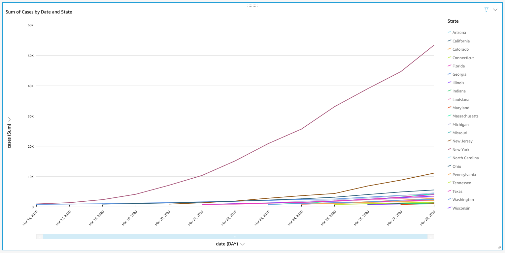

# Covid19 Data Downloader 

This is a lightweight data downloading pipeline. We grab data from [New York Times' GitHub repo for Covid 19 data](https://github.com/nytimes/covid-19-data). 
The project uses the Serverless Framework to deploy a Lambda Function and a CloudWatch Event to trigger that Lambda
Function every 4 hours. 

## Architecture

The data that we want to retrieve lives in a GitHub repository owned by the New York Times. I chose this data because it's
relatively well maintained, and needs very little transforms to be used (at least for my simple needs). The data is pulled 
down with a Lambda Function which then uploads the data to a S3 bucket. The Lambda Function is triggered every 4 hours via a 
CloudWatch Event. I used AWS Glue to create a table, and detect the 
schema of the data. Because the data is clean, and simple Glue was able to infer the schema perfectly. Once the Glue job completes, 
I have a usable table in Amazon Athena, with which I can explore the data using some standard SQL queries. The final steps 
in this process are to create a dataset in AWS QuickSight, and then create some visualizations. QuickSight automatically refreshes 
its data once every day. 

## Deployment

For this project I'm using the [Serverless Framework](https://serverless.com). When deployed, the Serverless Framework creates 
the required CloudFormation templates for the resources defined in [serverless.yml](serverless.yml) and then deploys. Serverless
also packages up the Lambda Function and puts the code on a S3 bucket, which is used by CloudFormation to create the Function.

The final part of the deployment process uses [GitHub Actions](https://github.com/features/actions) to do the deployment. 
The team that created the Serverless Framework also have published a GitHub action that can be used to deploy Serverless
projects. GitHub Actions creates build badges to show the status of the build (see above)  

## Example visualizations from QuickSight

This  visualization shows the daily cumulative cases and deaths, aggregated for all States. 

This visualization shows cumulative cases by County

Comparison analysis of the escalation of the virus by state

## To Do
- ~~Refactor serverless.yml. It's a bit of a mess right now.~~ 
